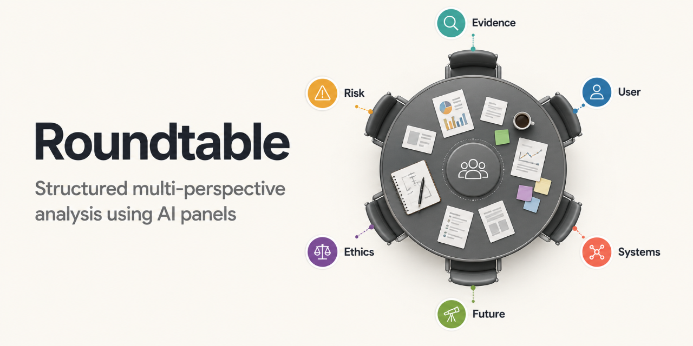

# Roundtable



A prompt framework for running structured multi-perspective analysis using AI. You give it a panel of personas and a problem, decision or piece of content. Each persona responds from their own distinct point of view. The friction between perspectives is the point.

Works with AI coding and agent tools that read project instructions from `AGENTS.md`.

---

## How it works

The project has four components:

**Persona files** describe individual thinkers — their background, approach, priorities, blind spots, voice, and the question they always ask. They live in subfolders named `Panel - {Group name}/`.

**Prompt files** contain the instructions that tell your AI how to run each type of session. You do not need to read them directly — your AI reads them automatically when you invoke a workflow.

**AGENTS.md** is the instruction layer that tells your AI how to use everything. Compatible AI coding and agent tools read it automatically when you open this folder.

The `_assets` folder contains shared files used by generated outputs and repository presentation, including the HTML template, output design guidance, and social preview image. You usually only need to edit these if you want to change how saved outputs look.

---

## Getting started

Open this folder in your AI tool of choice, such as Claude Cowork, Claude Code, OpenAI Codex, or another agent that reads `AGENTS.md`. You do not need to do any setup if your tool supports `AGENTS.md`; the AI will read the instructions automatically. If your tool does not support `AGENTS.md`, paste the contents of `AGENTS.md` into the conversation before asking it to run a Roundtable workflow.

Then use plain language to invoke one of the workflows below. At the end of each session, the AI will ask which format you want the output saved in: Markdown, Word document, or HTML. Markdown is the default if you skip the question.

Example outputs are included in `/_exampleoutput/` so you can see what each workflow produces in practice:
- [Panel Feedback - Stakeholder Map - AI Workflow Implementation Service Description.html](_exampleoutput/Panel%20Feedback%20-%20Stakeholder%20Map%20-%20AI%20Workflow%20Implementation%20Service%20Description.html)
- [Problem Solving - Disciplines - Fixed-Fee Scope Creep.md](_exampleoutput/Problem%20Solving%20-%20Disciplines%20-%20Fixed-Fee%20Scope%20Creep.md)
- [Decision Making - Time Horizons - Hire vs Contractors.docx](_exampleoutput/Decision%20Making%20-%20Time%20Horizons%20-%20Hire%20vs%20Contractors.docx)

**Disclaimer:** Roundtable outputs are generated by AI panels and may be incomplete, inaccurate, or inappropriate for your specific situation. Treat them as input to your own judgement, not professional advice, and follow any recommendations at your own risk.

---

## The three workflows

There are three distinct use cases. Choosing the right one matters — each produces a fundamentally different kind of output.

---

### 1. Panel Feedback — *critique something you've already made*

Use this when you have a finished or near-finished artifact — a document, proposal, pitch, landing page, strategy memo — and you want rigorous feedback on it. The panel reads the content and each persona delivers structured critique from their specific perspective. The session ends with a synthesis identifying where they agree, where they diverge, and the single highest-leverage change.

The output is reactive. You bring the work; the panel responds to it.

**When to use it:**
- You have a draft you want stress-tested before sharing it
- You want multiple viewpoints on the same document without running separate reviews
- You need to know what a regulator, an end user, and a skeptic would each say about the same thing

**How to invoke it:**
> "Give me panel feedback on this article from the Six Hats panel."

> "I want feedback on this proposal from the Stakeholder Map panel."

Output is saved as `Panel Feedback - {Panel} - {Title}`.

---

### 2. Problem Solving — *work through something you don't yet understand*

Use this when you have a problem — not a decision, not a document, but a situation where you're not sure what's actually going on or what to do about it. The panel runs a diagnostic workflow: it reframes the problem before anyone proposes solutions, maps root causes, generates distinct approaches from each persona's lens, and ends with a sequenced action map you can actually follow.

The output is a workflow, not a verdict. The emphasis is on understanding the problem correctly before acting on it.

**When to use it:**
- You're stuck and not sure why
- You've tried something and it didn't work, but you don't know what to change
- The problem feels more complex than your current framing of it
- You want to move from "something is wrong" to "here's what to try, in what order"

**How to invoke it:**
> "Help me think through this with the Disciplines panel. Here's the situation..."

> "I want to work through a problem using the Historical Figures panel."

Output is saved as `Problem Solving - {Panel} - {Title}`.

---

### 3. Decision Making — *pressure-test a decision before you commit*

Use this when you already know what you're deciding between and you want serious scrutiny before you commit. The panel runs as a formal board: personas are elected, a Chair is chosen, and the session moves through structured deliberation, cross-examination, and a final synthesis. The Chair drives toward a recommendation — not consensus, but a reasoned position with dissent documented.

The output is a recommendation with the reasoning and tradeoffs made explicit. It is designed for high-stakes choices where the cost of getting it wrong is significant.

**When to use it:**
- You have two or more real options and need to choose
- You want your assumptions challenged by people who think differently
- The stakes are high enough that "going with your gut" isn't sufficient
- You want a record of how the decision was made and what was weighed

**How to invoke it:**
> "Help me make a decision using the Time Horizons panel. Here are my options..."

> "I need to decide between two strategies. Run it through the Six Hats panel."

Output is saved as `Decision Making - {Panel} - {Title}`.

---

## Choosing between the three

| | Panel Feedback | Problem Solving | Decision Making |
|---|---|---|---|
| **You have...** | A finished artifact | A problem or situation | A choice between options |
| **You need...** | Critique and improvement | Diagnosis and a path forward | Scrutiny and a recommendation |
| **Output is...** | Scored feedback + synthesis | Sequenced action map | Reasoned recommendation |
| **Session feels like...** | A structured review | A working session | A board meeting |

---

## Default panels

Five panels ship with this project. Each one applies a different organising principle to produce a different kind of insight.

---

### Six Hats Framework

Six thinkers each embodying one of De Bono's thinking modes: White Hat (facts and information gaps), Red Hat (emotion and gut reaction), Black Hat (critical judgment and failure modes), Yellow Hat (constructive case for value and opportunity), Green Hat (generative ideas and lateral alternatives), Blue Hat (process control and meta-thinking). The panel ensures a problem is examined from all cognitive angles before a decision is made.

**Members:** Elena (White), James (Red), Richard (Black), Aisha (Yellow), Sam (Green), Diana (Blue)

**Use this panel for:**
- Evaluating a proposal before committing to it, when you want structured coverage of all angles rather than the loudest voices
- Creative challenges where the group defaults to critique too early, or to enthusiasm without rigour
- Any situation where the quality of the thinking process matters as much as the output — workshops, strategy sessions, high-stakes decisions

---

### Historical Figures

Six thinkers from history, each embodying a distinct intellectual tradition. The panel brings the weight of tested ideas and hard-won perspectives to bear on current problems.

**Members:** Leonardo da Vinci (cross-domain systems thinking), Marie Curie (empirical rigour), Frederick Douglass (moral clarity and power), Benjamin Franklin (pragmatism and diplomacy), Ada Lovelace (speculative imagination), Marcus Aurelius (Stoic long-termism)

**Use this panel for:**
- Big, complex questions where you want the full range of human intellectual tradition rather than contemporary professional categories
- Decisions with a significant ethical or moral dimension, where Douglass and Aurelius will force the group to confront what it is actually choosing
- Innovation and strategy questions where Lovelace's horizon-thinking and da Vinci's cross-domain curiosity are needed alongside Franklin's practicality and Curie's empirical restraint

---

### Time Horizons

Six thinkers each operating at a different temporal scale. The panel reveals how the same decision looks completely different depending on where you stand in time.

**Members:** Kai (days to weeks — tactical execution), Nina (weeks to quarters — product and iteration), Carlos (quarters to one year — operations and annual planning), Claire (one to five years — competitive strategy), Robert (five to twenty years — institutional capital), Amara (decades to generations — civilisational and systemic impact)

**Use this panel for:**
- Strategy decisions where near-term pressure and long-term positioning are in tension and you need to hold both simultaneously
- Investment or resource allocation decisions where the time horizon of the return is being left implicit
- Any situation where urgency is driving the conversation and you need to ask whether that urgency is real or manufactured

---

### Stakeholder Map

Six thinkers each representing a different affected party. The panel forces a decision to be examined from every position it touches, including the ones not in the room.

**Members:** Fatima (end user — lived experience), Dev (frontline worker — operational reality), Helen (middle manager — implementation friction), Graham (regulator — compliance and legal exposure), Zoe (investigative journalist — public scrutiny), Patrick (investor — financial return and assumptions)

**Use this panel for:**
- Product, policy, or service decisions where the people making the decision are not the people most affected by it
- Launch or rollout planning, where the gap between strategic intent and operational reality needs surfacing before it becomes a problem
- Decisions with public-facing consequences, reputational exposure, or regulatory dimensions that the internal team may be underweighting

---

### Disciplines

Six thinkers each bringing a different academic discipline to the problem. The panel applies six distinct methods to the same question and surfaces the dimensions any single discipline would miss.

**Members:** Isabel (economics — incentives and second-order effects), Owen (psychology — actual versus assumed behaviour), Nneka (sociology — social structures and power), Raj (engineering — systems thinking and failure modes), Sofia (philosophy — conceptual clarity and logical rigour), Bernard (history — precedent and long-run consequences)

**Use this panel for:**
- Complex, multi-dimensional problems where you do not know which lens is right and need the full range before narrowing
- Decisions with behavioural, ethical, or systemic dimensions that a purely financial or operational analysis would miss
- Situations where the group is overconfident — this panel will collectively find the incentive misalignment, the behavioural assumption, the structural blind spot, the failure mode, the reasoning flaw, and the historical precedent everyone missed

---

## Mixing personas from different panels

You do not have to use a default panel exactly as shipped. If no single panel fits the question, ask your AI to assemble a temporary panel from personas across multiple folders.

For example, a product launch decision might combine Elena from Six Hats for evidence quality, Fatima from Stakeholder Map for end-user reality, Graham from Stakeholder Map for regulatory risk, Claire from Time Horizons for strategy, and Raj from Disciplines for systems thinking.

If you find yourself reusing the same combination, copy those persona files into a new folder in `/_custompanels/` and save it as a custom panel.

---

## Creating a custom panel

Custom panels live in `/_custompanels/`. Each panel is a subfolder named `Panel - {Your panel name}/` containing individual persona files.

### Option 1 — Use the persona generator (recommended)

Ask your AI to generate a persona for you:

> "Generate a persona for a senior NHS nurse for a Healthcare panel."

> "Add a venture-backed startup CFO to a Finance panel."

The AI will ask for a name, role, and any context you want to provide, then write and save the file automatically in the correct format and location.

### Option 2 — Write personas by hand

Create a file named `Persona - {Name} - {Role}.md` in your panel subfolder. Each file follows this structure:

```
# Name — Role

## {Optional context field}

## Background
2–3 sentences covering seniority, experience, domain, and defining career context.

## Approach
The frameworks, mental models, and instincts this person brings to a problem.

## Priorities & constraints
What they are optimising for. What they will not compromise on.

## Blind spots & biases
One or two honest tendencies that make their perspective distinct but also limited.

## Voice & tone
How they communicate. 2–3 adjectives and a sample sentence in their voice.

## The question they always ask
One signature question this person reliably raises.
```

The optional context field sits between the name and Background, and surfaces the organising principle of the panel — for example `## Time horizon: days to weeks`, `## Stakeholder position: the person the decision is ultimately for`, or `## Discipline: economics`. Include it when the panel's logic gives each persona a distinct categorical role. Leave it out when it adds nothing. If other personas in the panel already have it, add a matching one for consistency.

### What makes a good panel

A panel works because the personas think differently — not just have different job titles. When building a custom panel, aim for genuine cognitive diversity: people who would actually disagree about what matters, what to prioritise, and how to reason about tradeoffs. A panel of five people who all optimise for the same thing is just one person with five voices.

Four to six personas is the right range. Below four, you lose coverage. Above six, personas start repeating each other.

Once you've created a panel folder with at least one persona file, the AI will find it automatically and include it in the list of available panels.

---

## License

Roundtable is available under the [MIT License](LICENSE).
